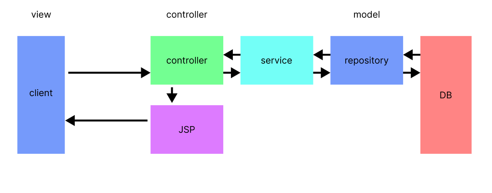
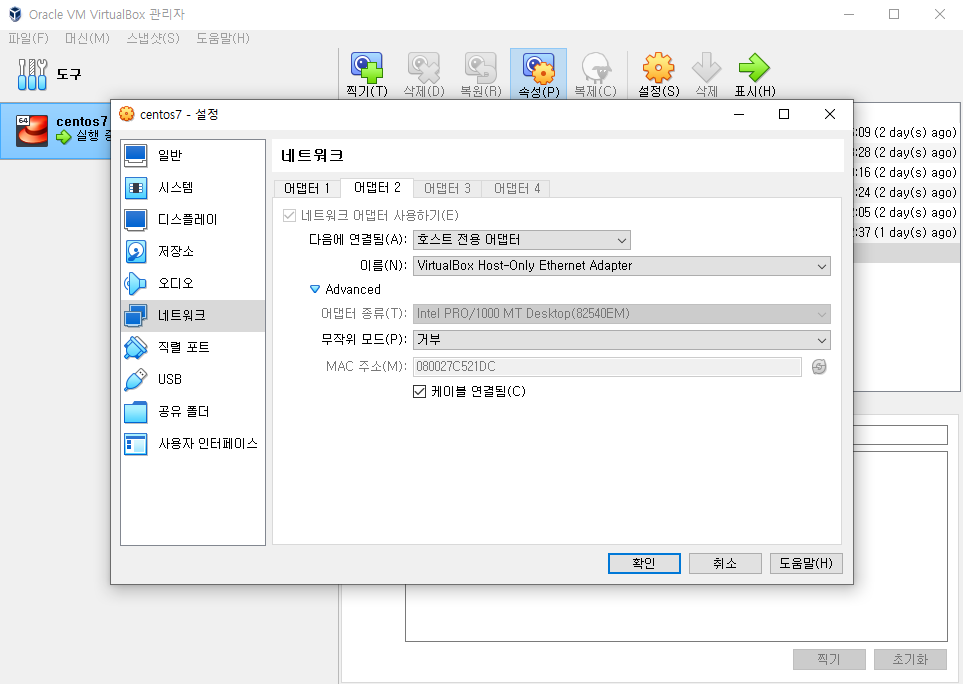
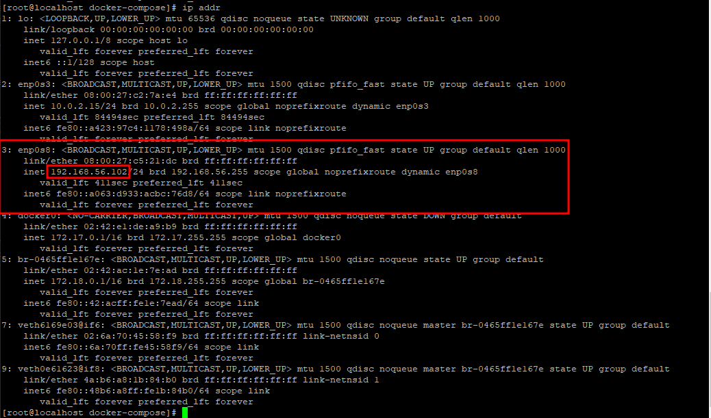
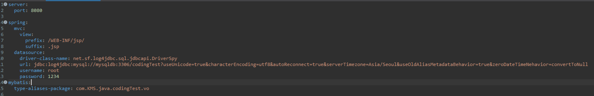

# Docker를 활용한 서버 제작
### VirtureBox Linux CentOs7 가상환경에서 테스트 진행하였습니다.

### dockerhub
  - [mysql](https://hub.docker.com/r/casatoo/mysql)
  - [springimg](https://hub.docker.com/r/casatoo/springimg)
  - [카페24개인가상서버] (http://1.234.44.77:8080/usr/get/ProductsData)

## MVC 패턴



## 네트워크 세팅
  
  
  

## dockerfile
- mysql
```
FROM mysql:8.0

ADD ./mysql-init-files /docker-entrypoint-initdb.d

CMD ["mysqld"]
```
- 이미지생성 시 query가 자동으로 실행될 수 있도록 함
- dockerfile 과 같은 폴더에 mysql-init-files 폴더 생성
- mysql-init-files 안에 create.sql 생성 테스트데이터 입력

- spring
```
FROM openjdk:18.0

COPY codingTest-0.0.1-SNAPSHOT.war ./

CMD java -jar codingTest-0.0.1-SNAPSHOT.war
```
- openjdk:18.0 환경으로 실행 이미지 생성

## 세팅법

- 필수 설치 vim, docker, docker-compose

- docker image 다운로드
```
docker pull casatoo/springimg
docker pull casatoo/mysql:8.0
```
- mysql 환경설정파일 생성(한글사용 시 글씨깨짐 방지)
```
cd /
mkdir mysql
cd mysql
vim my.cnf
```
- my.cnf
```
[client]
default-character-set=utf8mb4

[mysql]
default-character-set=utf8mb4

[mysqld]
character-set-server=utf8mb4
collation-server=utf8mb4_unicode_ci
skip-character-set-client-handshake

!includedir /etc/my.cnf.d
```
- 붙여넣기 후 :wq 로 저장
- docker-compose.yml 작성
```
cd /
mkdir docker-compose
cd docker-compose
vim docker-compose.yml
```
- docker-compose.yml
```
version: '3'

services:
  mysqldb:
    image: casatoo/mysql:8.0
    restart: always
    container_name: mysqldb
    environment:
      MYSQL_DATABASE: codingTest
      MYSQL_ROOT_PASSWORD: "1234"
    command: ['--character-set-server=utf8mb4', '--collation-server=utf8mb4_unicode_ci']
    ports:
      - '3306:3306'
    volumes:
      - /database/:/var/lib/mysql
      - /mysql/my.cnf:/etc/mysql/my.cnf
  spring:
    image: casatoo/springimg
    restart: always
    container_name: spring
    environment:
      SPRING_DATASOURCE_URL: jdbc:log4jdbc:mysql://mysqldb:3306/codingTest?useUnicode=true
      SPRING_DATASOURCE_USERNAME: root
      SPRING_DATASOURCE_PASSWORD: 1234
    ports:
      - '8080:8080'
    depends_on:
      - mysqldb
```
- docker-compose 실행
```
docker-compose up -d
```
---
# 데이터 조회
---
## product ( 상품정보 )

### 요청 메세지 명세
|항목명(영문)|항목명(국문)|항목타입|항목크기|항목구분|샘플데이터|
|---|---|---|---|---|---|
|productId|물품번호|INT UNSIGNED|0~4294967295|0|1|
|productName|물품이름|VARCHAR|200|0|화장품|
|companyId|등록업체번호|INT UNSIGNED|0~4294967295|0|1|

※ 항목구분: 필수(1), 옵션(0)
```
요청메세지
http://[아이피주소]:8080/usr/products/getProductData?productId=1&productName=화장품&companyId=1
```
```
응답메세지
{
  "total_item_count": 19,
  "list": [
    {
      "productId": 1,
      "productName": "화장품",
      "price": 20000,
      "regDate": "2023-01-01 16:40:01",
      "updateDate": null,
      "companyId": 1,
      "extra__companyName": "회사1"
    }
  ]
}
```

### 응답 메세지 명세
|항목명(영문)|항목명(국문)|항목타입|항목크기|항목구분|샘플데이터|
|---|---|---|---|---|---|
|productId|물품번호|INT UNSIGNED|0~4294967295|1|1|
|productName|물품이름|VARCHAR|200|1|화장품|
|price|물품가격|INT UNSIGNED|0~4294967295|1|20000|
|regDate|등록일자|DATETIME|---|1|---|
|updateDate|수정일자|DATETIME|---|1|---|
|companyId|등록업체번호|INT UNSIGNED|0~4294967295|1|1|
|extra__companyName|등록업체명|VARCHAR|200|1|회사1|

--- 
## company (등록업체)

### 요청 메세지 명세
|항목명(영문)|항목명(국문)|항목타입|항목크기|항목구분|샘플데이터|
|---|---|---|---|---|---|
|companyId|등록업체번호|INT UNSIGNED|0~4294967295|0|13|
|companyName|등록업체명|VARCHAR|200|0|3|
|ceoName|업체대표자명|VARCHAR|200|0|강대표|

※ 항목구분: 필수(1), 옵션(0)
```
요청메세지
http://[아이피주소]:8080/usr/Companys/getCompanyData?companyName=3&companyId=13&ceoName=강대표
```

```
응답메세지
{
  "total_item_count": 19,
  "list": [
    {
      "companyId": 13,
      "companyName": "회사13",
      "ceoName": "강대표",
      "phoneNumber": "010-1679-6068",
      "regDate": "2023-01-01 16:40:01",
      "updateDate": null
    }
  ]
}
```

### 응답 메세지 명세
|항목명(영문)|항목명(국문)|항목타입|항목크기|항목구분|샘플데이터|
|---|---|---|---|---|---|
|companyId|등록업체번호|INT UNSIGNED|0~4294967295|1|13|
|companyName|등록업체명|VARCHAR|200|1|회사13|
|ceoName|업체대표자명|VARCHAR|50|1|강대표|
|phoneNumber|전화번호|VARCHAR|20|1|01016796068|
|regDate|등록일자|DATETIME|---|1|---|
|updateDate|수정일자|DATETIME|---|1|---|

--- 
## customer (구매자)

### 요청 메세지 명세
|항목명(영문)|항목명(국문)|항목타입|항목크기|항목구분|샘플데이터|
|---|---|---|---|---|---|
|customerId|구매자번호|INT UNSIGNED|0~4294967295|0|1|
|customerName|구매자이름|VARCHAR|50|0|홍길동|

※ 항목구분: 필수(1), 옵션(0)
```
요청메세지
http://[아이피주소]:8080/usr/Customers/getCustomerData?customerId=1&customerName=홍길동
```

```
응답메세지
{
  "total_item_count": 15,
  "list": [
    {
      "customerId": 1,
      "customerName": "홍길동",
      "phoneNumber": "010-2349-1**6",
      "regDate": "2023-01-01 16:47:12",
      "updateDate": null
    }
  ]
}
```

### 응답 메세지 명세
|항목명(영문)|항목명(국문)|항목타입|항목크기|항목구분|샘플데이터|
|---|---|---|---|---|---|
|customerId|등록업체번호|INT UNSIGNED|0~4294967295|1|1|
|customerName|등록업체명|VARCHAR|50|1|홍길동|
|phoneNumber|업체대표자명|VARCHAR|50|1|010-2349-1**6|
|regDate|등록일자|DATETIME|---|1|---|
|updateDate|수정일자|DATETIME|---|1|---|
--- 
## order (구매정보)

### 요청 메세지 명세
|항목명(영문)|항목명(국문)|항목타입|항목크기|항목구분|샘플데이터|
|---|---|---|---|---|---|
|orderId|구매번호|INT UNSIGNED|0~4294967295|0|1|
|productId|상품번호|INT UNSIGNED|0~4294967295|0|1|
|customerId|구매자번호|INT UNSIGNED|0~4294967295|0|1|
|customerName|구매자이름|VARCHAR|50|0|홍길동|
|productName|구매자이름|VARCHAR|50|0|화장품|
|companyName|등록업체이름|VARCHAR|50|0|회사1|

※ 항목구분: 필수(1), 옵션(0)
```
요청메세지
http://[아이피주소]:8080/usr/Orders/getOrderData?orderId=1&productId=1&customerId=1&customerName=홍길동&productName=화장품&companyName=회사1
```

```
응답메세지
{
  "total_item_count": 19,
  "list": [
    {
      "orderId": 1,
      "regDate": "2022-12-29 15:28:27",
      "payment": 20000,
      "quantity": 1,
      "extra__customerName": "홍길동",
      "extra__productName": "화장품",
      "extra__companyName": "회사1",
      "extra__price": 20000
    }
  ]
}
```

### 응답 메세지 명세
|항목명(영문)|항목명(국문)|항목타입|항목크기|항목구분|샘플데이터|
|---|---|---|---|---|---|
|orderId|구매번호|INT UNSIGNED|0~4294967295|1|1|
|regDate|구매일자|VARCHAR|50|1|2022-12-29 15:28:27|
|payment|구매금액|INT UNSIGNED|0~4294967295|1|20000|
|quantity|구매갯수|INT UNSIGNED|0~4294967295|1|1|
|extra__customerName|구매자이름|VARCHAR|50|1|홍길동|
|extra__productName|상품이름|VARCHAR|50|1|화장품|
|extra__companyName|상품업체이름|VARCHAR|50|1|회사1|
|extra__price|상품가격|0~4294967295|50|1|20000|


# 데이터 입력

## 상품등록

### 요청 메세지 명세
|항목명(영문)|항목명(국문)|항목타입|항목크기|항목구분|
|---|---|---|---|---|
|productName|상품이름|VARCHAR|200|1|
|price|상품가격|INT UNSIGNED|0~4294967295|1|
|companyId|등록업체번호|INT UNSIGNED|0~4294967295|1|

※ 항목구분: 필수(1), 옵션(0)
```
http://[아이피주소]:8080/usr/products/createProductData?productName=[상품이름]&price=[상품가격]&companyId=[등록업체번호]
```

## 업체등록

### 요청 메세지 명세
|항목명(영문)|항목명(국문)|항목타입|항목크기|항목구분|
|---|---|---|---|---|
|companyName|상등록업체명품이름|VARCHAR|200|1|
|ceoName|업체대표자명|VARCHAR|50|1|
|phoneNumber|전화번호|VARCHAR|20|1|

※ 항목구분: 필수(1), 옵션(0)
```
http://[아이피주소]:8080/usr/Companys/createCompanyData?companyName=[등록업체명]&ceoName=[업체대표자명]&phoneNumber=[전화번호]
```

## 고객등록

### 요청 메세지 명세
|항목명(영문)|항목명(국문)|항목타입|항목크기|항목구분|
|---|---|---|---|---|
|customerName|고객이름|VARCHAR|50|1|
|phoneNumber|고객전화번호|VARCHAR|20|1|

※ 항목구분: 필수(1), 옵션(0)
```
http://[아이피주소]:8080/usr/Customers/createCustomerData?customerName=[고객이름]&phoneNumber=[고객전화번호]
```

## 구매정보등록

### 요청 메세지 명세
|항목명(영문)|항목명(국문)|항목타입|항목크기|항목구분|
|---|---|---|---|---|
|productId|상품번호|INT UNSIGNED|0~4294967295|1|
|customerId|구매자|INT UNSIGNED|0~4294967295|1|
|payment|금액|INT UNSIGNED|0~4294967295|1|
|quantity|구매수량|INT UNSIGNED|0~4294967295|1|

※ 항목구분: 필수(1), 옵션(0)
```
http://[아이피주소]:8080/usr/Orders/createOrderData?productId=[상품번호]&customerId=[구매자]&payment=[금액]&quantity=[구매수량]
```
